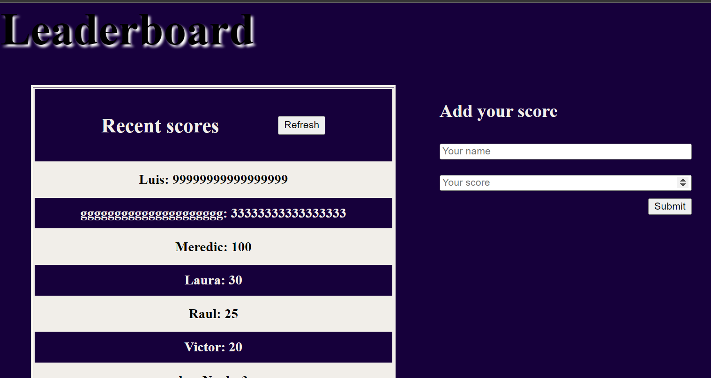

# Leaderboar app

> This is a single app designed as my first contact with an API. In this project we are storing the user name and the score of a ficticious game withing a remote third party API.

## Built With

- HTML, css and Javascript
- Webpack

## App screenshot

## Getting Started

You must add your name (Text or numbers) and score (only numbers) within the inputs and hit the submit button to send your data to the API. Then click the refresh button to get your position in the scores table.

## Authors

👤 **Luis pomare**

- GitHub: [@luis-pomare](https://github.com/luis-pomare)
- Twitter: [@LuisPomare1](https://twitter.com/LuisPomare1)
- LinkedIn: [luis-pomare-388116225](https://www.linkedin.com/in/luis-pomare-388116225/)

## Show your support

Give a ⭐️ if you like this project!

## 📝 License

This project is [MIT](./MIT.md) licensed.
